# Basic Calculation Assignment

## Description

This project contains basic JavaScript programs covering arithmetic operations, conditions, and type conversion.

---

## Output Screenshots

---

### 1. Declare Name, Age, City

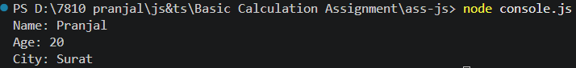

---

### 2. Two Number Operations

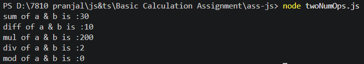

---

### 3. Display Message

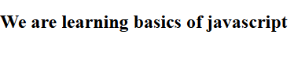
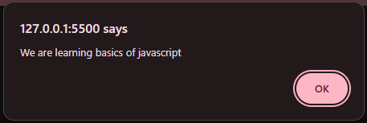
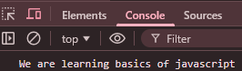

---

### 4. Square and Cube

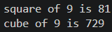

---

### 5. Area of Rectangle

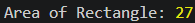

---

### 6. Data Types

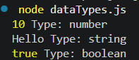

---

### 7. Any Type Variable

---

### 8. String to Number Conversion

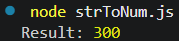

---

### 9. Number to String Conversion

---

### 10. String Number Addition

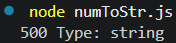

---

### 11. All Arithmetic Operations

---

### 12. Swap Using Third Variable

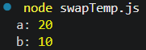

---

### 13. Swap Without Third Variable

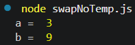

---

### 14. Grade Check

---

### 15. Electricity Bill

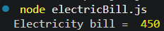

---

### 16. Salary Calculation

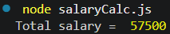

---

### 17. Voting Eligibility

---

### 18. Discount Calculation

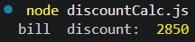

---

### 19. Celsius to Fahrenheit

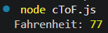

---

### 20. Minutes to Hours Conversion

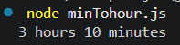

---

## by

Pranjal
# js-ts_basics
